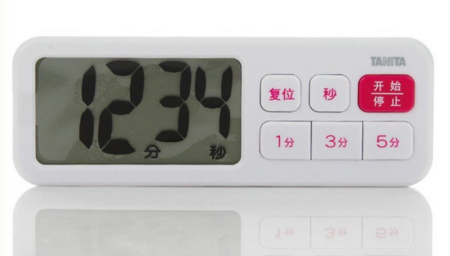
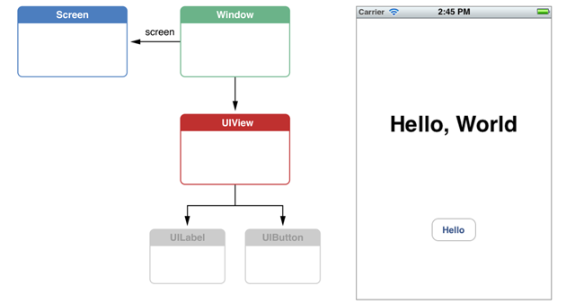
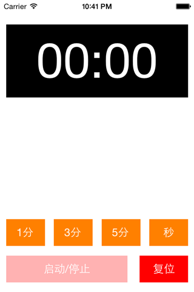
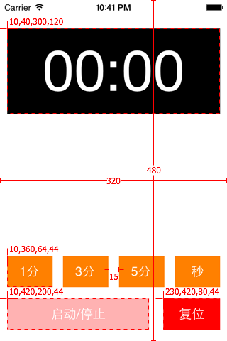
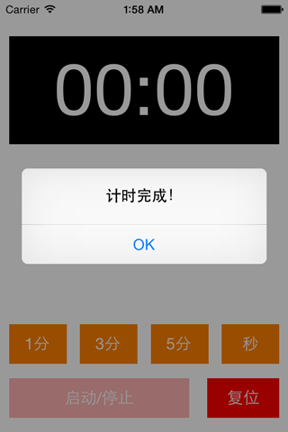
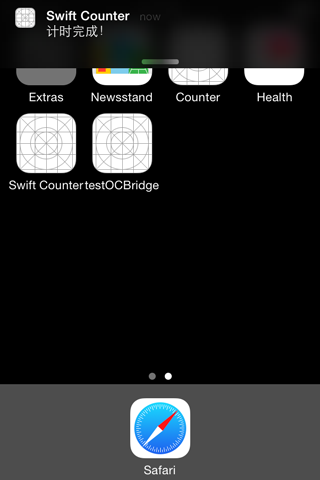

## 从零开始学Swift计时器App开发

本教程将从零开始教大家使用Swift来开发一款iOS计时器App。

这款App的灵感来自于我家厨房的百利达计时器，平时我主要用它来控制烹饪的时间和实践[番茄工作法](http://zh.wikipedia.org/wiki/%E7%95%AA%E8%8C%84%E5%B7%A5%E4%BD%9C%E6%B3%95)。

它的操作很简单：

- 点击`复位`可以对时间清零；
- 点击`秒`、`1分`、`3分`、`5分`可以不断增加倒计时时间；
- 点击 `开始/停止` 来启动或停止倒计时；

通过此教程，你将学习：

- 如何使用Xcode
- 如何灵活运用Swift中的语法来解决实际问题；
- 如何使用基本的UI控件[UIButton](https://developer.apple.com/library/ios/documentation/uikit/reference/UIButton_Class/UIButton/UIButton.html)、[UILabel](https://developer.apple.com/library/ios/documentation/uikit/reference/UILabel_Class/Reference/UILabel.html) 来创建界面，使用[NSTimer](https://developer.apple.com/library/mac/documentation/Cocoa/Reference/Foundation/Classes/NSTimer_Class/Reference/NSTimer.html)来触发定时事件，以及使用[UILocalNotification](https://developer.apple.com/library/ios/documentation/iphone/Reference/UILocalNotification_Class/Reference/Reference.html)来实现本地提醒。

### 项目源代码

项目托管在GitHub上，请参考[这里](https://github.com/lifedim/SwiftCasts/tree/master/001_swift_counter)。

### 创建项目

首先，打开Xcode，新建一个项目，Xcode将提示选择一个工程模板。由于我们将从零开始学习，请在左侧窗口选则`iOS/Application`，右侧窗口选择`Empty Application`，点击`Next`，然后在`Product Name`项填入`SwiftCounter`，`Language`注意选择`Swift`，再点击`Next`，选择项目保存的路径，最后点击`Create`即可完成项目创建。

项目新建完成后，我们可以看到工程中已经自动生成了`AppDelegate.swift`文件。

### 应用代理类（AppDelegate）

`AppDelegate`类中定义了app进入不同生命周期（包括app启动动、闲置、进入后台、进入前台、激活、完全退出）时的回调方法。实际上在app启动时，app会自动执行一个叫`main`的入口函数，它通过调用`UIApplicationMain`函数来创建出`AppDelegate`类实例，并委托其实现app在不同生命周期的定制行为。

### 屏幕（Screen）、窗口（Window）和视图（View）

在app启动完成的回调方法`application:didFinishLaunchingWithOptions`中，首先创建一个`UIWindow`对象。在此，我先简单介绍一下iOS开发中基本UI元素：

- `UIScreen` 代表一块物理屏幕；
- `UIWindow` 代表一个窗口，在iPhone上每个app一般只有一个窗口，而在Mac上一个app经常有多个窗口；
- `UIView` 代表窗口里某一块矩形显示区域，用来展示用户界面和响应用户操作；
- `UILabel`和`UIButton`，继承自`UIView`的特定UI控件，实现了特定的样式和行为。

继续看`application:didFinishLaunchingWithOptions`中的默认实现：

	self.window = UIWindow(frame: UIScreen.mainScreen().bounds)
	self.window!.backgroundColor = UIColor.whiteColor()
	self.window!.makeKeyAndVisible()

首先，它通过获取主屏幕的尺寸，创建了一个跟屏幕一样大小的窗口；然后将其背景色为白色；并调用`makeKeyAndVisible()`方法将此窗口显示在屏幕上。

### 试图控制器（ViewController）

在iOS开发中，主要使用`ViewController`来管理与之关联的View、响应界面横竖屏变化以及协调处理事务的逻辑。每个`ViewController`都有一个`view`对象，定制的UI对象都将添加到此`view`上。

为了给计时器创建页面并实现功能，我们需要新建一个试图控制器，命名为`CounterViewController`：点击文件，新建文件，类型选择`Swift`，然后输入类名`CounterViewController`，确定。

我们先为其添加基础的结构代码：

	import Foundation
	import UIKit
	
	class CounterViewController : UIViewController {
	
	    override func viewDidLoad()  {
	        super.viewDidLoad()
	    }
	}

其中重载的方法`viewDidLoad`非常重要，它在控制器对应的`view`装载入内存后调用，主要用来创建和初始化UI。

在介绍如何定制计时器UI之前，我们需要先将`CounterViewController`的`view`跟app中唯一的窗口`Window`关联起来。完成此操作只需在`application:didFinishLaunchingWithOptions`中加一行代码：

    self.window!.rootViewController = CounterViewController()
    
这样`CounterViewController`的`view`会自动添加到`Window`上，用户启动app后直接看到的将是`CounterViewController`中`view`的内容。

### 创建计时器UI界面

在Xcode中创建UI的方法有很多种，包括使用`Nib`或`Storyboard`文件的可视化方式，以及使用纯代码的方式。由于代码创建UI是可视化创建UI的基础，本篇教程只介绍使用代码创建UI的方式。

先看一下我们最终的UI效果图：

- 在view上方，我们将定义一个标签`UILabel`来显示剩余时间；
- 在view下方，我们定义了一排橘黄色的按钮`UIButton`，接受用户点击操作；
- 在view最下方，我们定义了`启动/停止`按钮和`复位`按钮，接受用户点击操作。

为了能保存和引用这些UI控件，我们要为它们创建属性:

    ///UI Controls
    var timeLabel: UILabel? //显示剩余时间
    var timeButtons: UIButton[]? //设置时间的按钮数组
    var startStopButton: UIButton? //启动/停止按钮
    var clearButton: UIButton? //复位按钮
    
注意，所有的UI变量类型后面都带了`?`号，表示它们是`Optional`类型，其变量值可以为`nil`。`Optional`类型实际上是一个枚举`enum`，里面包含`None`和`Some`两种类型。`nil`其实是`Optional.None`，`非nil`是`Option.Some`，它通过`Some(T)`来包装（`wrap`）原始值，详细解释请参考[Swift之?和!][1]。

Swift中非`Optional`类型（任何不带`?`号的类型）必须通过设置默认值或在构造函数`init`中完成初始化。前面有提到，`ViewController`中的UI控件主要是在`viewDidLoad`方法中进行创建和初始化的，所以我们必须将UI控件设置为`Optional`类型。

其次，考虑到时间按钮的样式和功能基本相同，而且以后可能会增加或删减类似按钮，我们使用一个数组`timeButtons`来保存所有的时间按钮。同时，因为每个按钮的显示标题跟点击后增加的时间不同，我们还需要定义一个数组`timeButtonInfos`来保存不同按钮的信息：

	let timeButtonInfos = [("1分", 60), ("3分", 180), ("5分", 300), ("秒", 1)]
	
`timeButtonInfos`在初始化之后不会再有改变，所以我们使用`let`将其定义为常量。它是一个数组，其中每个元素是一个元组（`tuple`），包含了对应按钮的标题和点击后增加的秒数。

由于UI创建的代码比较多，全部写到`viewDidLoad`中会很乱。所以接下来，我们定义了3个方法，分别用来完成3部分UI控件的创建：

- 创建倒计时剩余时间的标签

	    ///UI Helpers
	    func setupTimeLabel() {
	        timeLabel = UILabel()
	        timeLabel!.textColor = UIColor.whiteColor()
	        timeLabel!.font = UIFont(name: nil, size: 80)
	        timeLabel!.backgroundColor = UIColor.blackColor()
	        timeLabel!.textAlignment = NSTextAlignment.Center
	
	        self.view.addSubview(timeLabel)
	    }

这个方法首先使用默认构造函数`UILabel()`创建了一个UILabel实例并赋值给timeLabel属性。然后将`timeLabel`文本颜色设置为白色、字体设置为80号大小的默认字体、背景色设为黑色，标签中的文本设置为居中对齐。具体UILabel的使用方法，请参考[UILabel](https://developer.apple.com/library/ios/documentation/uikit/reference/UILabel_Class/Reference/UILabel.html)。

需要注意的是，在赋值时，每个`timeLabel`后都带上了一个`!`号，这是因为`timeLabel`实际上是`Optional`类型，它像一个黑盒子一样包装了（`wrap`）原始值，所以在使用它的原始值时必须先用`!`操作符来拆包（`unwrap`），详细解释请参考[Swift之?和!][1]。

最后，我们将`timeLabel`添加到了控制器对应的`view`上。

- 创建一组时间按钮

	    func setuptimeButtons() {
	
	        var buttons: UIButton[] = []
	        for (index, (title, _)) in enumerate(timeButtonInfos) {
	
	            let button: UIButton = UIButton()
	            button.tag = index //保存按钮的index
	            button.setTitle("\(title)", forState: UIControlState.Normal)
	
	            button.backgroundColor = UIColor.orangeColor()
	            button.setTitleColor(UIColor.whiteColor(), forState: UIControlState.Normal)
	            button.setTitleColor(UIColor.blackColor(), forState: UIControlState.Highlighted)
	
	            button.addTarget(self, action: "timeButtonTapped:", forControlEvents: UIControlEvents.TouchUpInside)
	
	            buttons += button
	            self.view.addSubview(button)
	
	        }
	        timeButtons = buttons
	
	    }

    
首先我们创建了一个空数组，用来临时保存生成的按钮。接下来，考虑到在`timeButtons`中指定位置`index`的button对应的是`timeButtonInfos`中相同位置的信息，我们需要获得这个`index`。

通过使用 `enumerate` 全局函数我们可以为`timeButtonInfos`创建一个包含`index`以及数组中元素（也是元组）的元组`(index, (title, _))`。由于暂时用不到`timeButtonInfos`中元组的第二个参数（点击增加的时间），我们使用`_`替代命名，表示不生成对应的变量。

接着在每次循环开始，我们创建了一个`UIButton`实例。每个继承自`UIView`的类（包括`UIButton`）都继承了属性`tag`，它主要用一个整数来标记某个view。此处，我们将按钮信息所在的`index`赋值给`button.tag`，用来标记button对应的信息所处的位置。

接着我们设置了按钮的标题、背景色、不同点击状态下的标题颜色等，具体UIButton的使用方法请参考[UIButton](https://developer.apple.com/library/ios/documentation/uikit/reference/UIButton_Class/UIButton/UIButton.html)。

除了显示作用，按钮还可以响应用户的点击操作。我们通过`addTarget:action:forControlEvents:`方法给`button`添加了可以相应`按下按钮并抬起`操作的回调方法：`timeButtonTapped:`。

最后我们将这个临时按钮加入`buttons`数组，并将此按钮添加到视图上。

当所有按钮创建完毕，我们将这个临时按钮数组赋值给`timeButtons`，以方便日后引用。

- 创建2个操作按钮

	    func setupActionButtons() {
	
	        //create start/stop button
	        startStopButton = UIButton()
	        startStopButton!.backgroundColor = UIColor.redColor()
	        startStopButton!.setTitleColor(UIColor.whiteColor(), forState: UIControlState.Normal)
	        startStopButton!.setTitleColor(UIColor.blackColor(), forState: UIControlState.Highlighted)
	        startStopButton!.setTitle("启动/停止", forState: UIControlState.Normal)
	        startStopButton!.addTarget(self, action: "startStopButtonTapped:", forControlEvents: UIControlEvents.TouchUpInside)
	
	        self.view.addSubview(startStopButton)
	
	        clearButton = UIButton()
	        clearButton!.backgroundColor = UIColor.redColor()
	        clearButton!.setTitleColor(UIColor.whiteColor(), forState: UIControlState.Normal)
	        clearButton!.setTitleColor(UIColor.blackColor(), forState: UIControlState.Highlighted)
	        clearButton!.setTitle("复位", forState: UIControlState.Normal)
	        clearButton!.addTarget(self, action: "clearButtonTapped:", forControlEvents: UIControlEvents.TouchUpInside)
	
	        self.view.addSubview(clearButton)
	
	    }

上面方法中分别为`startStopButton`设置了点击后的回调方法`startStopButtonTapped:`；为`clearButton`设置了点击后的回调方法`clearButtonTapped:`。

接着，我们简单定义了这几个所需的按钮按下回调方法：

	///Actions & Callbacks
    func startStopButtonTapped(sender: UIButton) {
    }

    func clearButtonTapped(sender: UIButton) {
    }

    func timeButtonTapped(sender: UIButton) {
    }

    func updateTimer(timer: NSTimer) {
    }
    
然后在`CounterViewController`的`viewDidLoad`方法中，我们通过调用上面定义好的UI创建方法来创建主页面：

    ///Overrides
    override func viewDidLoad()  {
        super.viewDidLoad()

        self.view.backgroundColor = UIColor.whiteColor()
        setupCounterLabel()
        setuptimeButtons()
        setupActionButtons()

    }

在Xcode中使用快捷键`CMD+R`运行app，发现预想中的界面并没有出现，这是因为我们还没有设置每个UI控件的位置和大小。

实际上，所有继承自`UIView`的UI控件类都可以使用`init:frame:`构造函数来创建指定位置、大小的UI控件。

如果你的app只支持一种方向的屏幕（比如说竖屏），这样做是没问题的；但如果你的app需要同时支持竖屏和横屏，那么最好重载`ViewController`中的`viewWillLayoutSubviews`方法。这个方法会在`ViewController`中的视图`view`大小改变时自动调用（横竖屏切换会改变视图控制器中`view`的大小），也提供了最好的时机来设置UI控件的位置和大小。

所以我们在`CounterViewController`中重载此方法，并为每个UI控件设置了合适的位置和大小：

    override func viewWillLayoutSubviews() {
        super.viewWillLayoutSubviews()

        timeLabel!.frame = CGRectMake(10, 40, self.view.bounds.size.width-20, 120)

        let gap = ( self.view.bounds.size.width - 10*2 - (Float(timeButtons!.count) * 64) ) / Float(timeButtons!.count - 1)
        for (index, button) in enumerate(timeButtons!) {
            let buttonLeft = 10 + (64 + gap) * Float(index)
            button.frame = CGRectMake(buttonLeft, self.view.bounds.size.height-120, 64, 44)
        }

        startStopButton!.frame = CGRectMake(10, self.view.bounds.size.height-60, self.view.bounds.size.width-20-100, 44)
        clearButton!.frame = CGRectMake(10+self.view.bounds.size.width-20-100+20, self.view.bounds.size.height-60, 80, 44)

    }
    
在iOS设备中，视图坐标系是以左上角`(0,0)`为原点，使用`CGRect`结构体来表示一个矩形位置，使用`CGRectMake`全局函数来创建矩形结构体的实例。每个继承自`UIView`的UI类都有一个类型为`CGRect`的`frame`属性，用来保存其在父view中的位置。

我们首先设置了`timeLabel`的frame，其左上角为`(10,40)`，宽度为整个`CounterViewController`中`view`的宽度-20（为右边也留出10的边），高度为120；

其次我同通过循环整个时间按钮数组，为每个按钮设置了合适的frame。这里为了让时间按钮的排列能够自动适应不同屏幕的宽度，我们先计算中每个按钮之间的间距`gap`，然后根据`gap`、按钮的宽度`64`来确定每个按钮的左边距`buttonLeft`，并最终得到每个按钮的`frame`。

最后，我们为`startStopButton`按钮和`clearButton`也设置了合适的frame。

竖屏模式iPhone4S下，各控件通过计算后得出的frame值如下：

此时，再次`CMD+R`运行app，就能看到预期的界面了。

### 添加逻辑功能

界面已开发完毕，现在我们考虑为计时器app添加以下功能：

- 设置时间
- 启动和停止倒计时
- 在计时完成后进行提醒

#### 1. 设置时间

在使用倒计时器时，我们发现每次点击时间按钮，当前倒计时的时间会累加；而当开始倒计时时，倒计时的时间又会递减。这些操作都牵扯到一个重要的状态：当前倒计时的时间，而且这个状态是不断变化的。

所以我们考虑为这个状态定义一个变量，表示`当前倒计时剩余的秒数`：

    var remainingSeconds: Int = 0
    
我们期望当用户点击时间按钮时，app内部会增加`remainingSeconds`的值；当点击复位按钮时，会设置`remainingSeconds`的值为0；当计时开始时，会逐秒减少`remainingSeconds`的值。并且当`remainingSeconds`发生变化时，能够及时更新UI，在`timeLabel`上显示正确的剩余时间。

为实现这些功能，首先我们在时间按钮和复位按钮点击的回调方法中对`remainingSeconds`值作调整：

    func clearButtonTapped(sender: UIButton) {
        remainingSeconds = 0
    }

    func timeButtonTapped(sender: UIButton) {
        let (_, seconds) = timeButtonInfos[sender.tag]
        remainingSeconds += seconds
    }

按钮回调方法中的唯一参数`sender`，代表触发此回调方法的控件。在`timeButtonTapped:`方法中，我们通过控件的tag来找到对应的按钮的信息。按钮信息是一个元组，其中第二个参数存储着每次点击按钮需要增加的秒数，我们将此秒数增加到`remainingSeconds`上。

现在在设置或复位时间时，`remainingSeconds`的值可以正常更新了，我们需要考虑如何让UI界面也能及时显示剩余时间。通常的做法，是在按钮的回调方法中，除了设置`remainingSeconds`的值，也同时通过设置`timeLabel`的`text`属性来更新UI。这种做法可以解决问题，但并不最佳方案，因为我们除了需要在`timeButtonTapped:`中设置UI；也需要在`clearButtonTapped:`中设置UI；还需要在计时器启动后，在适当的回调中逐秒递减时设置UI。这样会造成很多重复的代码，且难于管理。

其实我们可以使用更`Swift`的方式来解决状态跟UI的同步问题：使用属性的`willSet`和/或`didSet`方法，请参考[Property Observers](https://developer.apple.com/library/prerelease/ios/documentation/swift/conceptual/swift_programming_language/Properties.html#//apple_ref/doc/uid/TP40014097-CH14-XID_333)。

    var remainingSeconds: Int = 0 {
    willSet(newSeconds) {
        let mins = newSeconds/60
        let seconds = newSeconds%60
        self.timeLabel!.text = NSString(format:"%02d:%02d", mins, seconds)
    }
    }

在此，我们给`remainingSeconds`属性添加了一个`willSet`方法，这个方法会在`remainingSeconds`的值将要变化的时候调用，并传入变化后的新值作为唯一参数。

在这个方法里，我们先通过整除`/`和取余`%`的方式得到倒计时秒数对应的分钟，和除分钟数外的秒数。假如新值为80（秒），那么计算后，mins值为1，second值为20。

然后，我们通过使用Objective-C中定义的字符串类型`NSString`来格式化这两个数值，让其显示为`分钟:秒钟`的形式：比如新值为80，那么格式化后的字符串为`01:20`。这里多提一句，Swift中提供了自带的`String`类，它能跟`Obejctive-C`定义的`NSString`互相兼容。在使用`Swift`编程时，我们主要使用`String`来处理字符串，但由于`String`类目前还没有提供格式字符串相关的方法，我们只能求助于`NSString`类型。

#### 2.启动和停止倒计时

通过点击`启动/停止`按钮，我们可以启动或停止倒计时。这种操作能让计时器呈现2种不同的状态：正在计时 和 没有计时。为了实现此功能，我们定义了一个布尔类型变量`isCounting`：

    var isCounting: Bool = false
    
同时，在启动计时器后，我们需要每间隔1秒钟就更新一次UI界面的剩余时间。为实现这种定时触发的功能，我们需要用到`Foundation`库中定义的[NSTimer](https://developer.apple.com/library/mac/documentation/Cocoa/Reference/Foundation/Classes/NSTimer_Class/Reference/NSTimer.html)。

为此我们定义了一个`NSTimer`类型变量`timer`：

	var timer: NSTimer?

接着，在用户点击`启动/停止`按钮时触发的回调方法`startStopButtonTapped:`中，我们切换了`isCounting`的状态：

    func startStopButtonTapped(sender: UIButton) {
        isCounting = !isCounting
    }

同样，为了实现界面同步，我们为`isCounting`属性添加了`willSet`方法：

    var isCounting: Bool = false {
    willSet(newValue) {
        if newValue {
            timer = NSTimer.scheduledTimerWithTimeInterval(1, target: self, selector: "updateTimer:", userInfo: nil, repeats: true)
        } else {
            timer?.invalidate()
            timer = nil
        }
        setSettingButtonsEnabled(!newValue)
    }
    }

当`isCounting`的新值`newValue`为`true`时，我们将通过调用`NSTimer`的类方法`scheduledTimerWithTimeInterval:target:selector:userInfo:repeats:`创建并启动一个每1秒钟调用1次`updateTimer:`方法的timer，并将返回的实例保存到`timer`中。

同时我们定义了`updateTimer:`方法来更新当前的倒计时时间：

    func updateTimer(timer: NSTimer) {
        remainingSeconds -= 1
    }

当`isCounting`的新值`newValue`为`false`时，我们将暂停`timer`并将`timer`设置为`nil`。

此外，由于时间按钮和复位按钮只在计时器停止时起作用，在计时器启动时无效，我们还提供了辅助方法 `setSettingButtonsEnabled:` 用来设置这些按钮在不同`isCounting`状态下的样式（settingButtons是指在设置时间时，也就是计时器停止时可以操作的按钮）：

    func setSettingButtonsEnabled(enabled: Bool) {
        for button in self.timeButtons! {
            button.enabled = enabled
            button.alpha = enabled ? 1.0 : 0.3
        }
        clearButton!.enabled = enabled
        clearButton!.alpha = enabled ? 1.0 : 0.3
    }

### 在计时完成后进行提醒

当倒计时自然结束时（不是人为点击`启动/停止`按钮来停止），如果当前app还处于激活状态（用户没有按`Home`键退出），那么我们此时将弹出一个警告窗口([UIAlertView](https://developer.apple.com/library/ios/documentation/uikit/reference/UIAlertView_Class/UIAlertView/UIAlertView.html))，来提示倒计时已完成：

    func updateTimer(timer: NSTimer) {
        remainingSeconds -= 1
        
        if remainingSeconds <= 0 {
            let alert = UIAlertView()
            alert.title = "计时完成！"
            alert.message = ""
            alert.addButtonWithTitle("OK")
            alert.show()
        }        
        
    }

我们使用通用构造函数创建了一个`UIAlertView`实例，设置好标题和按钮，最后调用`show()`方法将其显示出来。效果参照下图： 

很多情况下，用户在app计时未结束时就离开了计时器app（计时器处于未激活状态），那么当计时完成时，我们如何来通知用户呢？对这种情况，我们可以使用系统的本地通知[NSLocalNotification](https://developer.apple.com/library/ios/documentation/iphone/Reference/UILocalNotification_Class/Reference/Reference.html)。我们先定义一个辅助方法`createAndFireLocalNotificationAfterSeconds:`来创建和注册一个N秒钟后的本地提醒事件：

    func createAndFireLocalNotificationAfterSeconds(seconds: NSTimeInterval) {

        UIApplication.sharedApplication().cancelAllLocalNotifications()
        let notification = UILocalNotification()
        notification.fireDate = NSDate(timeIntervalSinceNow:seconds);
        notification.timeZone = NSTimeZone.systemTimeZone();
        notification.alertBody = "计时完成！";

        UIApplication.sharedApplication().scheduleLocalNotification(notification);

    }

在方法实现中，我们先调用`cancelAllLocalNotifications`取消了所有当前app已注册的本地消息。之后创建了一个新的本地消息对象`notification`。

接下来我们要为notifcation设置消息的激活时间。我们通过`NSDate(timeIntervalSinceNow: double)`构造器创建了从当前时间往后推N秒的一个时间。由于方法接受的参数`timeIntervalSinceNow`是`double`类型，我们先将`Int`类型`seconds`通过`bridgeToObjectiveC()`方法转换成兼容的`NSNumber`对象，再调用其`doubleValue`方法获得对应的值。

如同`String`之于`NSString`，Swift中的`Int`、`Float`类都能跟`Objective-C`中的`NSNumber`类互相兼容。由于Swift中没有提供将`Int`转换为`double`类型的方法，我们也不得不求助于`NSNumber`，通过`bridgeToObjectiveC()`方法将`Int`对象转换成对应的`NSNumber`对象。

之后我们将本地消息的时区设置为系统时区，提示消息为“计时完成！”。并最终完成此消息的注册。

接下来，我们更新了`启动/停止`按钮响应的`startStopButtonTapped:`回调方法：

    func startStopButtonTapped(sender: UIButton) {
        isCounting = !isCounting

        if isCounting {
            createAndFireLocalNotificationAfterSeconds(remainingSeconds)
        } else {
            UIApplication.sharedApplication().cancelAllLocalNotifications()
        }

    }

在启动计时器时创建并注册计时完成时的本地提醒；当计时器停止时，取消当前app所注册的所有本地提醒。

值得注意的是，在iOS8中使用本地消息也需要先获得用户的许可，否则无法成功注册本地消息。因此，我们将询问用户许可的代码片段也添加到了app启动后的入口方法中（`AppDelegate`中的`didFinishLaunchingWithOptions`）：

        //register notification
        application.registerUserNotificationSettings(UIUserNotificationSettings(forTypes: UIUserNotificationType.Sound | UIUserNotificationType.Alert |
            UIUserNotificationType.Badge, categories: nil
            ))

最终本地消息提醒的效果参考下图：

至此，一个完整的倒计时app已开发完毕。

### 后记

通过完成此教程，我对`Swift`语言的理解也更进了一步。`Swift`是一门全新的语言，作为开发者，我们需要不断加深对这门语言的理解，并灵活使用语言提供的特性来编程。虽然在开发中还需要大量使用`Cocoa(Touch)`中提供的`Objective-C`类库，但编程的方式已经完全改变了，不仅仅是将`Objective-C`代码翻译成`Swift`代码，而需要在代码层面进行重新思考。

再有，由于Xcode6Beta版本的不稳定，本篇教程中的大部分代码是在[AppCode](http://www.jetbrains.com/objc/)中完成的。如果大家使用Xcode6Beta时也出现了各种问题，可以考虑先使用AppCode，有1个月的试用期。它跟Xcode的操作基本一致，没有提供语法提示，但也不会频繁崩溃和出现超高的CPU占用导致死机。

[1]: (http://joeyio.com/ios/2014/06/04/swift---/)

