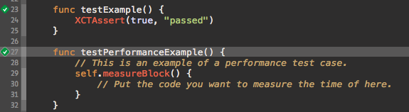
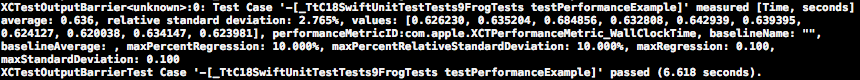

## Swift 单元测试介绍


这篇教程将简要介绍如何在Swift项目中使用`XCTest.framework`进行代码单元测试。本教程中用到的示例代码托管在[Github]()

首先我们新建一个项目`SwiftUnitTest`，它将在`SwiftUnitTestTests`目录下自动创建出一个默认测试用例文件`SwiftUnitTestTests.swift`：

	import XCTest
	
	class SwiftUnitTestTests: XCTestCase {
	    
	    override func setUp() {
	        super.setUp()
	        //在此添加变量准备代码。此方法在每个测试用例执行前执行
	    }
	    
	    override func tearDown() {
	        super.tearDown()
	       	//在此添加变量清理代码。此方法在每个测试用例执行后执行
	    }
	    
	    func testExample() {
	    	//这是一个测试用例
	        XCTAssert(true, "passed")
	    }
	    
	    func testPerformanceExample() {
	    	//这是一个性能测试用例
	        self.measureBlock() {
	        	//在此填写需要测量运行时间的代码
	        }
	    }
	    
	}

在这个文件中定义了一个测试用例类`SwiftUnitTestTests`，它里面包含了一个`setUp()`方法和`tearDown()`方法，分别用来在每个测试方法运行之前做初始化准备，和在测试方法运行之后做清理工作。此外，它还包含了以`test`开头命名的2个测试方法：`testExample()`和`testPerformanceExample()`。

我们需要注意：

- 任何以`test`开头命名的的方法都是一个测试方法，在每次单元测试执行时自动执行，它没有无返回值；
- 在测试方法中，可以使用`self.measureBlock() { }`来测量代码的运行时间；
- 测试方法执行的顺序跟测试方法名有关，比如`test01()`会优先于`test02()`执行

通过快捷键`CMD+U`即可运行单元测试。可以看到所有测试方法已通过：



同样，使用`CMD+SHIFT+Y`打开`Console`也能看到相应测试方法的运行提示。

### 定制测试用例

如果本身项目中没有测试用例文件，或者为了管理方便，可以为某个类创建一个新的测试用例文件。

我们先创建一个简单的类用来测试：

```js
	import Foundation

	class Frog {
	    
	    var name:String
	    
	    init() {
	        name = "Tadpole"
	    }
	    
	    func transform() {
	        name = "Frog"
	    }
	    
	}
```

这个类定义了一种青蛙类型，它有一个属性叫`name`，其初始状态为`Tadpole`蝌蚪。我们可以对其调用`transform`方法，之后它就变成了`Frog`青蛙。

然后我们新建一个针对青蛙类做测试的测试用例文件：选择`Test Case Class`, 为此类取名为`FrogTests`（建议使用`<待测试类名>Tests`的形式）：

然后我们删除原来的`testExample`测试方法，并新建方法:

    func testFrogTransformation() {
        
        let frog = Frog()
        frog.transform()
        
        XCTAssert(frog.name == "Frog", "Pass")
        
    }
    
> 注意：如果此时Xcode提示无法找到`Frog`的类定义，请在顶部加上 `import SwiftUnitTest`。里面的`SwiftUnitTest`是当前项目的名称。

在此测试方法中，我们创建出了一个新的青蛙类，然后对其调用`transform()`方法。这时我们使用断言`XCTAssert`来判断frog目前的`name`属性值是否为`Frog`。`XCTAssert`是一个全局函数，它的第一个参数为布尔表达式，如果为`true`表示断言通过；它的第二个参数为断言的描述。

Swift中支持ObjC中原有的所有断言：

- XCTAssert(expression, format...)当expression求值为TRUE时通过；
- XCTAssertTrue(expression, format...)当expression求值为TRUE时通过；
- XCTAssertNil(a1, format...)为空判断，a1为空时通过，反之不通过；
- XCTFail(format…) 生成一个失败的测试；
- XCTAssertEqual(a1, a2, format...)判断相等（当a1和a2是 C语言标量、结构体或联合体时使用,实际测试发现NSString也可以）；
- ...

所有断言列表请参考[ios UnitTest 学习笔记](http://ko.bubufx.com/infodetail_4174.html)。但基本上所有其它的断言都是衍生自`XCTAssert`的，只使用`XCTAssert`基本能解决大部分问题。

此时执行`CMD+U`运行单元测试，可以看到测试用例已通过。

然后我们再修改原有测试方法`testPerformanceExample()`中的内容：

    func testPerformanceExample() {
        self.measureBlock() {
            var sum:Double = 0
            for i in 1..1000000 {
                sum += Double(i)
            }
        }
    }

再次`CMD+U`执行用例，等待几秒钟，可以看到测试用例都已通过，打开`console`可以看到`testPerformanceExample()`中代码的运行时间：



再次，Swift中基本的测试用例方法已完成。

### 后记

在Swift中进行单元测试跟在OC中进行单元测试的流程是一样的。但由于Swift的语法更简单，使用Swift写单元测试也变得比OC中更加有趣。


